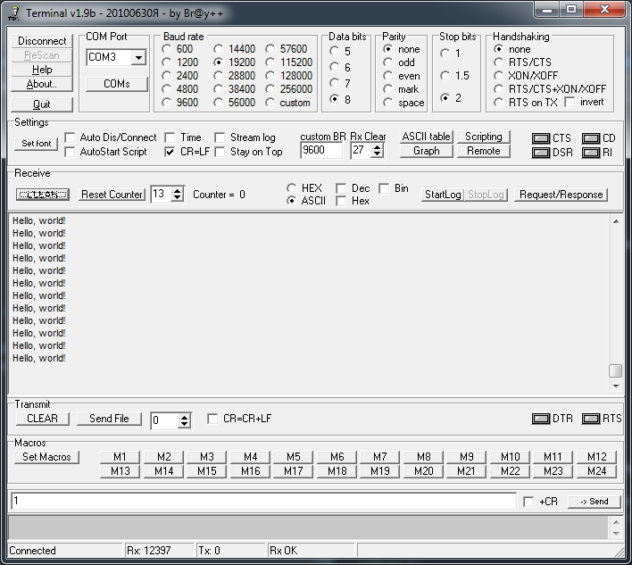

==  Передача данных через USART

---

=== *Выполнение работы:*

Целью работы является передача фразы "Hello World!" через интерфейс *USART* по прерыванию.
Для этого проделаем следующие действия:

1) Включаем внешний источник тактирования, подключаемся к нему и отключаем внутренний источник.:

[source, cpp]
----
 RCC::CR::HSEON::On::Set();
 while (!RCC::CR::HSERDY::Ready::IsSet())
 { }
 RCC::CFGR::SW::Hse::Set();
 while (!RCC::CFGR::SWS::Hse::IsSet())
 { }
 RCC::CR::HSION::Off::Set();
----

2)Подключаем модуль *USART2* к шине тактирования.

[source, cpp]
----
 RCC::AHB1ENR::GPIOAEN::Enable::Set();
 RCC::APB1ENR::USART2EN::Enable::Set();
----

3)Далее настраиваем порты А2 и А3 на прием и передачу.

[source, cpp]
----
 GPIOA::MODER::MODER3::Alternate::Set();
 GPIOA::MODER::MODER2::Alternate::Set();
 GPIOA::AFRL::AFRL3::Af7::Set();
 GPIOA::AFRL::AFRL2::Af7::Set();
----
4)Настраиваем порты *А2* и *А3* в режим Push-Pull(двухтактный выход) + Pull Up(подтяжка к 1):
[source, cpp]
----
 GPIOA::OTYPER::OT2::OutputPushPull::Set();
 GPIOA::OTYPER::OT3::OutputPushPull::Set();
 GPIOA::PUPDR::PUPDR2::PullUp::Set();
 GPIOA::PUPDR::PUPDR3::PullUp::Set();
----

5)Устанавливаем режим дискретизации 1/8, длину символа 8 бит, без контроля четности, два стоп бит и один старт бит:

[source, cpp]
----
 USART2::CR1::OVER8::Value0::Set(); //Режим дискритизации
 USART2::CR1::M::Value0::Set();//Длина символа
 USART2::CR2::STOP::Value0::Set();//Стоп бит
 USART2::CR1::PCE::Value0::Set();//Контроль четности
----
6)Устанавливаем скорость передачи данных _19200_ бод:

[source, cpp]
----
 uint32_t USART_DIV=16'000'000/(19'200*8*(2 - USART2::CR1::OVER8::Get()));
 USART2::BRR::DIV_Mantissa::Set(USART_DIV);
----

6)Разрешаем глобальное прерывание.

[source, cpp]
----
 NVIC::ISER1::Write(1<<6);
----

6)Включаем  модуль *USART* битом *UE* в регистре *CR1*.

[source, cpp]
----
 USART2::CR1::UE::Enable::Set();
----

7)Настраиваем *TIM2* на 1 секунду.

[source, cpp]
----
 RCC::APB1ENR::TIM2EN::Enable::Set();
 TIM2::PSC::Write(7999) ;
 TIM2::ARR::Write(1000) ;
 TIM2::SR::UIF::NoInterruptPending::Set();
 TIM2::CNT::Write(0);
 TIM2::CR1::CEN::Enable::Set();
----

8)В *main* разрешаем передачу, устанавливаем прерывание по передаче
и передаем один байт строки и ждем переполнения таймера.

[source, cpp]
----
int main()
{
  char buff[] = "Hello, world!\n";
  for(;;)
  {
      USART2::CR1::TE::Enable::Set();
      USART2::CR1::TXEIE::InterruptWhenTXE::Set();
      USART2::DR::Write(buff[0]);
      while(TIM2::SR::UIF::NoInterruptPending::IsSet()) ;
      TIM2::SR::UIF::NoInterruptPending::Set();

  }
  return 1;
}
----

9)После отправки первого байта срабатывает
прерывание. В обработчике мы передаем следующий байт, снова срабатывает прерывание
и снова отправляем следующий байт. После отправки последнего байта передача и прерывание запрещаются.

[source, cpp]
----
char buff[] = "Hello, world!\n ";
uint8_t j = 1;
class UART_interrupt
{
public:
  static void handler()
  {
    USART2::DR::Write(buff[j++]);

    if (j > strlen(buff))
    {
      USART2::CR1::TE::Disable::Set();
      USART2::CR1::TXEIE::InterruptInhibited::Set();
      j = 1U;
    }
  }
};

----
Код программы представлен ниже.

[source, cpp]
----

#include "gpioaregisters.hpp" //for Gpioa
#include "rccregisters.hpp"   //for RCC
#include "nvicregisters.hpp"  //for NVIC
#include "usart2registers.hpp" //for UART
#include "tim2registers.hpp"   //for TIM2

extern "C"
{

  int __low_level_init(void)
  {

    RCC::CR::HSEON::On::Set();
    while (!RCC::CR::HSERDY::Ready::IsSet())
    { }
    RCC::CFGR::SW::Hse::Set();
    while (!RCC::CFGR::SWS::Hse::IsSet())
    { }
    RCC::CR::HSION::Off::Set();
    RCC::AHB1ENR::GPIOAEN::Enable::Set();

    RCC::APB1ENR::USART2EN::Enable::Set();

    GPIOA::MODER::MODER2::Alternate::Set();
    GPIOA::MODER::MODER3::Alternate::Set();
    GPIOA::AFRL::AFRL2::Af7::Set();
    GPIOA::AFRL::AFRL3::Af7::Set();

    GPIOA::OTYPER::OT2::OutputPushPull::Set();
    GPIOA::OTYPER::OT3::OutputPushPull::Set();
    GPIOA::PUPDR::PUPDR2::PullUp::Set();
    GPIOA::PUPDR::PUPDR3::PullUp::Set();

    uint32_t USART_DIV = 16'000'000/(19'200*8*(2 - USART2::CR1::OVER8::Get()));
    USART2::BRR::DIV_Mantissa::Set(USART_DIV);

    USART2::CR1::OVER8::OversamplingBy8::Set();
    USART2::CR1::M::Data8bits::Set();
    USART2::CR2::STOP::Value2::Set();
    USART2::CR1::PCE::ParityControlDisable::Set();

    NVIC::ISER1::Write(1<<6);

    USART2::CR1::UE::Enable::Set();

    RCC::APB1ENR::TIM2EN::Enable::Set();
    TIM2::PSC::Write(7999) ;
    TIM2::ARR::Write(1000) ;
    TIM2::SR::UIF::NoInterruptPending::Set();
    TIM2::CNT::Write(0);
    TIM2::CR1::CEN::Enable::Set();

    return 1;
  }
}

int main()
{
  char buff[] = "Hello, world!\n";
  for(;;)
  {
      USART2::CR1::TE::Enable::Set();
      USART2::CR1::TXEIE::InterruptWhenTXE::Set();
      USART2::DR::Write(buff[0]);
      while(TIM2::SR::UIF::NoInterruptPending::IsSet()) ;
      TIM2::SR::UIF::NoInterruptPending::Set();

  }
  return 1;
}

----

Результат работы программы.

.Вывод строки в Terminal
